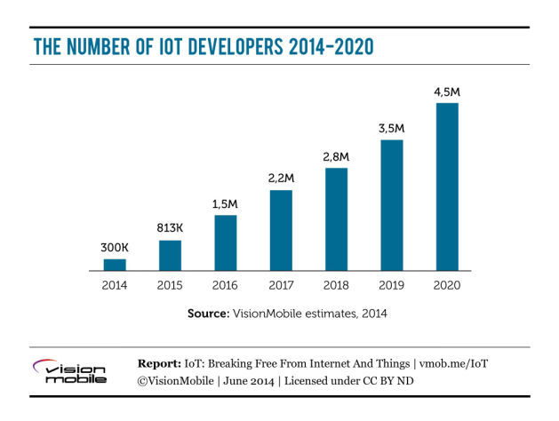
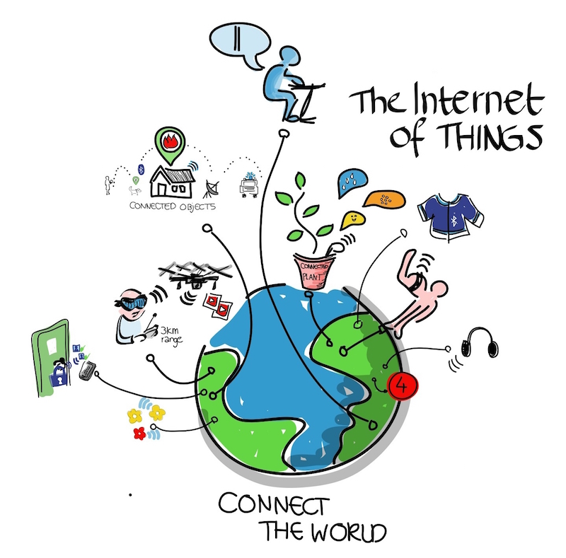

#物联网资料合集

这是一个收集物联网相关资源的repo，包含以下内容:

 - blog 	  相关博客
 - books	  相关书籍
 - framework 相关框架
 - hardware 相关硬件 
 - libraray 相关库
 - os  相关操作系统
 - platform 相关平台
 - protocol 相关协议
 - security  安全
 - technologies 技术栈
 - tools	工具
 - website	网站

#物联网

> 物联网是新一代信息技术的重要组成部分，其英文名称是：“The Internet of things”。顾名思义，物联网就是物物相连的互联网。这有两层意思：其一，物联网的核心和基础仍然是互联网，是在互联网基础上的延伸和扩展的网络；其二，其用户端延伸和扩展到了任何物品与物品之间，进行信息交换和通信 也就是物物相息。物联网就是“物物相连的互联网”。

##物联网开发人员数量预测

##相关应用

###环境监测

> 在物联网的环境监测应用程序通常使用的传感器，以协助环保监测空气或水质，大气和土壤条件，[42]，甚至可以包括像监测野生动物及其栖息地的运动领域。

###基础设施管理

> 物联网基础设施，可用于监视任何事件或改变结构性条件会危及安全，增加风险。它也可以被用于调度修理和维护活动以有效的方式，通过协调不同的服务供应商和有关设施的用户之间的任务。

###工业应用

> 网络控制和制造设备，资产和管理情况，或生产过程控制管理带来的物联网行业应用和智能制造以及领域之内。

> 数字控制系统自动化过程控制，运营商工具和服务的信息系统，以优化工厂的安全和保障是物联网的范围之内。

###能源管理

> 感测和致动系统的集成，连接到因特网，是有可能，以优化能耗为一个整体。

###医疗卫生系统

> 物联网设备可用于监测和控制各类建筑物（如，公共和私人，工业，机构，或住宅）使用的机械，电气和电子系统。

###交通运输系统

> 物联网可以协助集成通信，控制，和在各种运输系统的信息处理

###大规模部署

> 有物联网的一些计划或正在进行大规模的部署，以便更好地管理城市和系统。例如，松岛，韩国，首开先河，设施齐全，有线智能城市，已接近完成。
