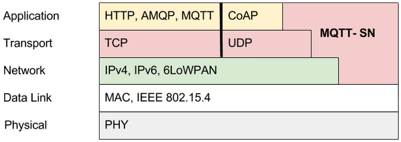
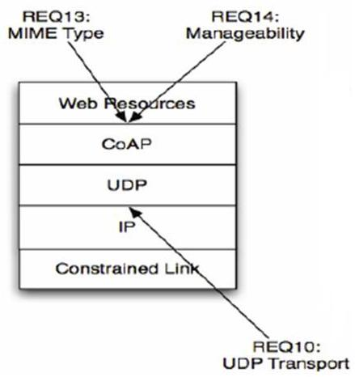
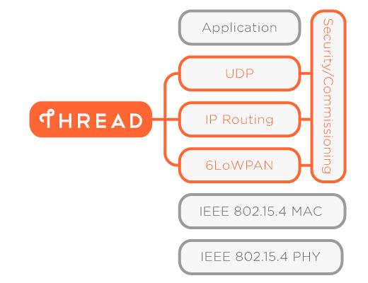

已停止维护, 请关注: [OpenSource IoT](https://github.com/phodal/opensource-iot)

相关: [嵌入式工程师知识](http://github.com/phodal/eks)

##IoT Protocol

Protocol |	CoAP  |	XMPP |	RESTful HTTP |	MQTT
---------|---------|---------|---------|---------
Transport |	UDP |	TCP |	TCP |	TCP
Messaging |	Request/Response |	Publish/Subscribe Request/Response |	Request/Response |	Publish/Subscribe Request/Response
2G, 3G, 4G Suitability (1000s nodes) | Excellent |	Excellent |	Excellent |	Excellent
LLN Suitability (1000s nodes) | Excellent |	Fair |	Fair |	Fair
Compute Resources | 10Ks RAM/Flash | 10Ks RAM/Flash | 10Ks RAM/Flash | 10Ks RAM/Flash
Success Storied	| Utility Field Area Networks |		Remote management of consumer white goods |	Smart Energy Profile 2 (premise energy management/home services) |	Extending enterprise messaging into IoT applications

English
---

[English Version](./EN.md)

中文
---

###XMPP

XMPP是一种基于标准通用标记语言的子集XML的协议，它继承了在XML环境中灵活的发展性。因此，基于XMPP的应用具有超强的可扩展性。经过扩展以后的XMPP可以通过发送扩展的信息来处理用户的需求，以及在XMPP的顶端建立如内容发布系统和基于地址的服务等应用程 序。而且，XMPP包含了针对服务器端的软件协议，使之能与另一个进行通话，这使得开发者更容易建立客户应用程序或给一个配好系统添加功能。

###MQTT

MQTT（Message Queuing Telemetry Transport，消息队列遥测传输）是IBM开发的一个即时通讯协议，有可能成为物联网的重要组成部分。该协议支持所有平台，几乎可以把所有联网物品和外部连接起来，被用来当做传感器和致动器（比如通过Twitter让房屋联网）的通信协议。

[MQTT相关库](./protocol/MQTT.lib.md)
[MQTT相关库介绍](./protocol/MQTT.lib.md)

###CoAP

CoAP是受限制的应用协议(Constrained Application Protocol)的代名词。在最近几年的时间中，专家们预测会有更多的设备相互连接，而这些设备的数量将远超人类的数量。在这种大背景下，物联网和M2M技术应运而生。虽然对人而言，连接入互联网显得方便容易，但是对于那些微型设备而言接入互联网非常困难。在当前由PC机组成的世界，信息交换是通过TCP和应用层协议HTTP实现的。但是对于小型设备而言，实现TCP和HTTP协议显然是一个过分的要求。为了让小设备可以接入互联网，CoAP协议被设计出来。CoAP是一种应用层协议，它运行于UDP协议之上而不是像HTTP那样运行于TCP之上。CoAP协议非常的小巧，最小的数据包仅为4字节。

###RESTful HTTP

REST 指的是一组架构约束条件和原则。满足这些约束条件和原则的应用程序或设计就是 RESTful。

Web 应用程序最重要的 REST 原则是，客户端和服务器之间的交互在请求之间是无状态的。从客户端到服务器的每个请求都必须包含理解请求所必需的信息。如果服务器在请求之间的任何时间点重启，客户端不会得到通知。此外，无状态请求可以由任何可用服务器回答，这十分适合云计算之类的环境。客户端可以缓存数据以改进性能。

###Thread

Thread是一种基于简化版IPv6的网状网络协议，该协议由行业领先的多家技术公司联合开发，旨在实现家庭中各种产品间的互联，以及与互联网和云的连接。Thread易于安装、高度安全，并且可扩展到数百台设备。Thread基于低成本、低功耗的802.15.4芯片组开发。目前正在使用的大量产品，只需一次简单的软件升级，便可支持Thread。

##相关Web技术

##Z-Wave

> Z-Wave是一种新兴的基于射频的、低成本、低功耗、高可靠、适于网络的短距离无线通信技术。工作频带为908.42MHz(美国)~868.42MHz(欧洲)，采用FSK(BFSK/GFSK)调制方式，数据传输速率为9.6 kbps，信号的有效覆盖范围在室内是30m，室外可超过100m，适合于窄带宽应用场合。随着通信距离的增大，设备的复杂度、功耗以及系统成本都在增加，相对于现有的各种无线通信技术，Z-Wave技术将是最低功耗和最低成本的技术，有力地推动着低速率无线个人区域网。

##Zigbee

> ZigBee是基于IEEE802.15.4标准的低功耗局域网协议。根据国际标准规定，ZigBee技术是一种短距离、低功耗的无线通信技术。这一名称（又称紫蜂协议）来源于蜜蜂的八字舞，由于蜜蜂(bee)是靠飞翔和“嗡嗡”(zig)地抖动翅膀的“舞蹈”来与同伴传递花粉所在方位信息，也就是说蜜蜂依靠这样的方式构成了群体中的通信网络。其特点是近距离、低复杂度、自组织、低功耗、低数据速率。主要适合用于自动控制和远程控制领域，可以嵌入各种设备。简而言之，ZigBee就是一种便宜的，低功耗的近距离无线组网通讯技术。

###Websocket

> WebSocket protocol 是HTML5一种新的协议。它是实现了浏览器与服务器全双工通信(full-duplex)。

###SOAP

> 简单对象访问协议是交换数据的一种协议规范，是一种轻量的、简单的、基于XML（标准通用标记语言下的一个子集）的协议，它被设计成在WEB上交换结构化的和固化的信息。

###6LoWPAN

> IETF 6LoWPAN取得的突破是得到一种非常紧凑、高效的IP实现，消除了以前造成各种专门标准和专有协议的因素。这在工业协议（BACNet、LonWorks、通用工业协议和监控与数据采集）领域具有特别的价值。这些协议最初开发是为了提供特殊的行业特有的总线和链路(从控制器区域网总线到AC电源线)上的互操作性。

###UDP

> UDP协议的全称是用户数据报协议，在网络中它与TCP协议一样用于处理数据包，是一种无连接的协议。在OSI模型中，在第四层——传输层，处于IP协议的上一层。UDP有不提供数据包分组、组装和不能对数据包进行排序的缺点，也就是说，当报文发送之后，是无法得知其是否安全完整到达的。UDP用来支持那些需要在计算机之间传输数据的网络应用。包括网络视频会议系统在内的众多的客户/服务器模式的网络应用都需要使用UDP协议。UDP协议从问世至今已经被使用了很多年，虽然其最初的光彩已经被一些类似协议所掩盖，但是即使是在今天UDP仍然不失为一项非常实用和可行的网络传输层协议。

###uIP

> uIP 由瑞典计算机科学学院(网络嵌入式系统小组)的Adam Dunkels 开发。其源代码由C 语言编写，并完全公开。

> uIP 协议栈去掉了完整的 TCP/IP 中不常用的功能，简化了通讯流程，但保留了网络通信必须使用的协议，设计重点放在了 
IP/TCP/ICMP/UDP/ARP 这些网络层和传输层协议上，保证了其代码的通用性和结构的稳定性。

###DTLS

> DTLS(Datagram Transport Layer Security)即数据包传输层安全性协议。TLS不能用来保证UDP上传输的数据的安全，因此Datagram TLS试图在现存的TLS协议架构上提出扩展，使之支持UDP，即成为TLS的一个支持数据报传输的版本。DTLS 1.0基于TLS 1.1, DTLS 1.2基于TLS 1.2。

###NFC

> NFC近场通信技术是由非接触式射频识别（RFID）及互联互通技术整合演变而来，在单一芯片上结合感应式读卡器、感应式卡片和点对点的功能，能在短距离内与兼容设备进行识别和数据交换。工作频率为13.56MHz.但是使用这种手机支付方案的用户必须更换特制的手机。目前这项技术在日韩被广泛应用。手机用户凭着配置了支付功能的手机就可以行遍全国：他们的手机可以用作机场登机验证、大厦的门禁钥匙、交通一卡通、信用卡、支付卡等等。

###WiFi

> Wi-Fi是一种可以将个人电脑、手持设备（如pad、手机）等终端以无线方式互相连接的技术，事实上它是一个高频无线电信号。无线保真是一个无线网络通信技术的品牌，由Wi-Fi联盟所持有。目的是改善基于IEEE 802.11标准的无线网路产品之间的互通性。有人把使用IEEE 802.11系列协议的局域网就称为无线保真。甚至把无线保真等同于无线网际网路（Wi-Fi是WLAN的重要组成部分）

##物联网相关平台

###Yeelink

主页: [http://www.yeelink.net/](http://www.yeelink.net/)

###SiteWhere

> The Open Platform for the Internet of Things ™

> 这个项目提供了一个完整的平台，来管理物联网设备、收集数据并用外部系统进行数据整合。SiteWhere发行版本可以下载或在亚马逊云中使用。它还集成了多个大数据工具，包括MongoDB和ApacheHBase。

主页: [http://www.sitewhere.org/](http://www.sitewhere.org/)

###DeviceHive

> 该项目提供一个支持连接设备到物联网的机器对机器通信框架。它包括支持创建网络易于使用基于web的管理软件、应用安全规则和监控设备。该网站提供内置有DeviceHub的样本项目，而且它也有一个“游乐场”部分，允许用户使用DeviceHub在线去看它是如何工作的。

主页: [http://www.devicehive.com/](http://www.devicehive.com/)

###Devicehub.net

> Devicehub.net描述自己为“物联网的开源支柱”。它是一个基于云的服务，存储物联网相关的数据，提供数据的可视化并允许用户在网页上控制物联网设备。开发者使用该服务创建跟踪健康信息的应用程序，监视孩子的位置，自动化家电，跟踪车辆数据，监测天气等等。
> 
主页: [http://devicehub.net/](http://devicehub.net/)

###IoT Toolkit

> 这个项目背后的组织正使用各种工具工作，来集成多个物联网相关的传感器网络和协议。虽然主要的项目时一个智能对象应用程序，但该组织也工作在一个HTTP对Coap的情景下，一个带有嵌入式软件代理的应用程序框架等等。在硅谷，他们也发起了一个“遇见”组织，面向对物联网开发有情趣的人。

主页: [http://iot-toolkit.com/](http://iot-toolkit.com/)

###Mango(芒果)

> “芒果”自称是“世界上最流行的开源的机器对机器软件”。基于网络的它支持多个平台。它的主要功能包括支持多协议和数据库、元点、用户自定义事件、导入/导出等等。

###Nimbits

> Nimbits可以存储和处理特定的数据类型，数据可以是时间标记的或地理标记的。作为服务的公用平台是可用的，或者你也可以下载这个软件并部署它到谷歌应用引擎、或亚马逊EC2上的J2EE服务器上、或一个树莓派上。它支持多种编程语言，包括Arduino、JavaScript、HTML或Nimbits.io Java库。

###OpenRemote

> OpenRemote为基于家居的爱好者、集成商、分销商和制造商提供了四种不同的集成工具。它支持十几种不同的现有协议，允许用户创建几乎任何类型的智能设备（他们能够想到和使用任何支持java的设备来控制它）。该平台是开源的，但在设计和产品开发过程中，该公司也出售各种支持、电子书等工具来进行帮助。

###ThingSpeak

> ThingSpeak可以处理HTTP请求，并存储和处理数据。这个开放数据平台的主要功能包括开放应用程序、实时数据收集、地理位置数据、数据处理和可视化、设备状态信息和插件。它可以集成多个硬件和软件平台，包括Arduino、树莓派、ioBridge/RealTime.io、Electic lmp、移动和网络应用、社会网络和MATLAB数据分析。除了开源版本，还提供托管服务。

##物联网相关嵌入式操作系统

> 实时系统（Real-time operating system,RTOS）的正确性不仅依赖系统计算的逻辑结果，还依赖于产生这个结果的时间。实时系统能够在指定或者确定的时间内完成系统功能和外部或内部、同步或异步时间做出响应的系统。因此实时系统应该在事先先定义的时间范围内识别和处理离散事件的能力；系统能够处理和储存控制系统所需要的大量数据。

###Contiki

**相关支持**: ``CoAP``,``TCP/IP网络支持``,``RPL路由``,``6Lowpan 报文压缩``,``Rime无线协议栈``

> Contiki是一个适用于有内存的嵌入式系统的开源的、高可移植的、支持网络的多任务操作系统。包括一个多任务核心、TCP/IP 堆栈、程序集以及低能耗的无线通讯堆栈。Contiki 采用 C 语言开发的非常小型的嵌入式操作系统，运行只需要几K的内存。

Contiki 是一个小型的，开源的，极易移植的多任务电脑操作系统。它专门设计以适用于一系列的内存受限的网络系统，包括从8位电脑到微型控制器的嵌入系统。它的名字来自于托尔·海尔达尔的康提基号。

Contiki只需几kilobyte的代码和几百字节的内存就能提供多任务环境和内建TCP/IP支持。

###LwIP

> LwIP是Light Weight (轻型)IP协议，有无操作系统的支持都可以运行。LwIP实现的重点是在保持TCP协议主要功能的基础上减少对RAM 的占用，它只需十几KB的RAM和40K左右的ROM就可以运行，这使LwIP协议栈适合在低端的嵌入式系统中使用。

> lwIP协议栈主要关注的是怎么样减少内存的使用和代码的大小，这样就可以让lwIP适用于资源有限的小型平台例如嵌入式系统。为了简化处理过程和内存要求，lwIP对API进行了裁减，可以不需要复制一些数据。

###FREERTOS

> FreeRTOS是一个迷你操作系统内核的小型嵌入式系统。作为一个轻量级的操作系统，功能包括：任务管理、时间管理、信号量、消息队列、内存管理、记录功能等，可基本满足较小系统的需要。

> 由于RTOS需占用一定的系统资源(尤其是RAM资源)，只有μC/OS-II、embOS、salvo、FreeRTOS等少数实时操作系统能在小RAM单片机上运行。相对μC/OS-II、embOS等商业操作系统，FreeRTOS操作系统是完全免费的操作系统，具有源码公开、可移植、可裁减、调度策略灵活的特点，可以方便地移植到各种单片机上运行，其最新版本为8.0.0版。

###mbed OS

**相关支持**: ``BLE``,``Celluar``,``WIFI``,``Zigbee``,``6LoWPAN``

> 一款基于ARM Cortex-M处理器的设备所设计的免费操作系统，配有安全、通讯和设备管理模块，支持低功率智能蓝牙标准、2G、3G与CDMA通信技术、Thread、Wi-Fi、802.15.4/6LoWPAN、TLS/DTLS、CoAP、HTTP、MQTT以及轻量级的M2M。而只需32-64kbRAM和256 kb闪存的配置，适合在小设备上运行。

> mbed™ OS is an operating system for IoT devices and is especially well-suited to run in energy constrained environments. The OS includes the connectivity, security and device management functionalities required in every IoT device.

 - Connectivity protocol stack support for Bluetooth® low energy, Cellular, Ethernet, Thread, Wi-fi®,  Zigbee IP, Zigbee NAN, 6LoWPAN
 - Automation of power management
 - Software asset protection and secure firmware updates for device security & management
 - Supports a wide range of ARM Cortex-M based hardware platforms from major MCU vendors
 - Support for OMA Lightweight M2M protocol for device management
 - Updatable and secure devices at the edge capable of additional processing and functionality
 - Banking-class end-to-end IP security across the communication channels through TLS & DTLS 
 - Future proof designs by supporting all the key open standards for connectivity and device management

###emOS

> embOS是一个优先级控制的多任务系统，是专门为各种微控制器应用于实时系统应用的嵌入式操作系统．是一个具有最小RAM和ROM占用的、高速的、多功能的高性能工具。

> 贯穿embOS的整个开发过程，微控制器有限的资源一直是开发者所顾忌的。五年来，该RTOS的内部结构已经被优化为不同客户的不同应用中，以满足工业需要。对不同微控制器的完全源码，使开发者很方便用实时操作系统构建实时程序。embOS是高度模块化的，只有需要的函数才被调用，占用的ROM非常小。 最小的内存占用：1kb ROM,30字节 RAM;由于提供源码文件，你可以用embOS灵活定制系统以满足实际需求。
任务之间可以通过旗语、邮箱和事件安全便利地通讯。

###Salvo

> Salvo™ is the first Real-Time Operating System (RTOS) designed expressly for very-low-cost embedded systems with severely limited program and data memory. With Salvo, you can quickly create low-cost, smart and sophisticated embedded products. Pumpkin™ has currently certified Salvo for use with:

###μC/OS-II

> uC/OS II(Micro Control Operation System Two) 是一个可以基于ROM运行的、可裁减的、抢占式、实时多任务内核，具有高度可移植性，特别适合于微处理器和控制器，是和很多商业操作系统性能相当的实时操作系统(RTOS)。

> 为了提供最好的移植性能，uC/OS II最大程度上使用ANSI C语言进行开发，并且已经移植到近40多种处理器体系上，涵盖了从8位到64位各种CPU(包括DSP)。 uC/OS II可以简单的视为一个多任务调度器，在这个任务调度器之上完善并添加了和多任务操作系统相关的系统服务，如信号量、邮箱等。其主要特点有公开源代码，代码结构清晰、明了，注释详尽，组织有条理，可移植性好，可裁剪，可固化。内核属于抢占式，最多可以管理60个任务。从1992年开始，由于高度可靠性、移植性和安全性，uC/OS II已经广泛使用在从照相机到航空电子产品的各种应用中。

###TinyOS

协议支持: ``CoAP``

[TinyCoAP](http://tinyos.stanford.edu/tinyos-wiki/index.php/CoAP_-13)

> TinyOS是UC Berkeley（加州大学伯克利分校）开发的开放源代码操作系统，专为嵌入式无线传感网络设计，操作系统基于构件（component-based）的架构使得快速的更新成为可能，而这又减小了受传感网络存储器限制的代码长度。

> TinyOS的构件包括网络协议、分布式服务器、传感器驱动及数据识别工具。其良好的电源管理源于事件驱动执行模型，该模型也允许时序安排具有灵活性。TinyOS已被应用于多个平台和感应板中。

###MQX

> Freescale MQX™ RTOS a full-featured complimentary real-time operating system including the MQX™ Kernel, TCP/IP stack (RTCS), embedded MS-DOS file system (MFS), USB host/device stack, and more. The MQX™ multitasking kernel provides pre-emptive scheduling, fast interrupt response, extensive inter-process communication and synchronization facilities. MQX RTOS includes its own peripheral drivers.

###QNX

> QNX是由加拿大QSSL公司（QNX Software System Ltd.）开发的分布式实时操作系统。该操作系统既能运行于以Intel X86、Pentium等CPU为核心硬件环境下，也能运行于以PowerPC、MIPS等CPU为核心的硬件环境。QNX操作系统符合POSIX基本标准和实时标准，使其应用可以方便的进行移植。

###openWRT

> OpenWrt 可以被描述为一个嵌入式的 Linux 发行版，（主流路由器固件有 dd-wrt,tomato,openwrt三类）而不是试图建立一个单一的、静态的系统。OpenWrt的包管理提供了一个完全可写的文件系统，从应用程序供应商提供的选择和配置，并允许您自定义的设备，以适应任何应用程序。

> 对于开发人员，OpenWrt 是使用框架来构建应用程序，而无需建立一个完整的固件来支持；对于用户来说，这意味着其拥有完全定制的能力，可以用前所未有的方式使用该设备。

###RIOT
项目首页: [http://riot-os.org/](http://riot-os.org/)
平台: ``MSP430``, ``ARM7``, ``Cortex-M0``, ``Cortex-M3``,``Cortex-M4``,``x86``
> RIOT自称为“友好的物联网操作系统”。RIOT是FeuerWhere项目的分支，首次亮相在2013年。它的目的是既开发者友好又资源友好。它支持多种架构，包括MSP430、ARM7、Cortex-M0、Cortex-M3、Cortex-M4和标准的x86电脑。

#物联网相关库

##CoAP协议

###libcoap

语言: ``C``

主页: [http://sourceforge.net/projects/libcoap/](http://sourceforge.net/projects/libcoap/)

> Lightweight application-protocol for devices that are constrained their resources such as computing power, RF range, memory, bandwith, or network packet sizes. This protocol, CoAP, is developed in the IETF working group "CoRE", <http://6lowapp.net>.

###jCoAP

语言: ``Java``

主页: [https://code.google.com/p/jcoap/](https://code.google.com/p/jcoap/)

> jCoAP is a Java Library implementing the Constrained Application Protocol (CoAP)

###Node-CoAP

语言: ``Javascript`` (Nodejs)

主页: [https://github.com/mcollina/node-coap](https://github.com/mcollina/node-coap)

> node-coap is a client and server library for CoAP modelled after the http module.

###coap

语言: ``Python``

主页: [https://github.com/openwsn-berkeley/coap](https://github.com/openwsn-berkeley/coap)

> A CoAP Python library

> This package implements the Constrained Application Protocol (CoAP) developed by the IETF CORE working group.

###Californium (Cf) CoAP 

语言: ``Java``

主页: [https://github.com/mkovatsc/Californium](https://github.com/mkovatsc/Californium)

> Californium (Cf) is an open source implementation of the Constrained Application Protocol (CoAP). It is written in Java and targets unconstrained environments such as back-end service infrastructures (e.g., proxies, resource directories, or management services) and less constrained environments such as embedded devices running Linux (e.g., smart home controllers or vehicle sensors). Californium (Cf) has been running code for the IETF standardization of CoAP and was recently reimplemented to straighten changed design decisions, but also to improve its performance with focus on scalability. The new implementation was successfully tested at the ETSI CoAP#3 and OMA LWM2M Plugtests in November 2013.

##REST

###cJSON

语言: ``C``

主页: [http://sourceforge.net/projects/cjson/](http://sourceforge.net/projects/cjson/)

> JSON(JavaScriptObject Notation)是一种轻量级的数据交换格式。它基于JavaScript的一个子集。JSON采用完全独立于语言的文本格式，但是也使用了类似于C语言家族的习惯。这些特性使JSON成为理想的数据交换语言。易于人阅读和编写，同时也易于机器解析和生成。

##其他

###cURL

语言: ``C``

主页: [http://curl.haxx.se/](http://curl.haxx.se/)

> curl是利用URL语法在命令行方式下工作的开源文件传输工具。它被广泛应用在Unix、多种Linux发行版中，并且有DOS和Win32、Win64下的移植版本。

###HiveMQ

语言: ``Java``

主页: [http://www.hivemq.com/](http://www.hivemq.com/)

> HiveMQ 是一个企业级的 MQTT 代理，主要用于企业和新兴的机器到机器M2M通讯和内部传输，最大程度的满足可伸缩性、易管理和安全特性。提供免费的个人版。HiveMQ 提供了开源的插件开发包。

##物联网书籍

书名 | 作者 | 日期 | 类型 
------------ | ------------- | ------------ | ------------
[Learning Internet of Things](https://www.packtpub.com/application-development/learning-internet-things) | Peter Waher | 2015.02 | Book & Ebook|
[一步步搭建物联网系统](http://designiot.phodal.com) | Phodal Fengda & Fortware | 2014.11 | 电子书 | -
[Learning Internet of Things] |  - | - | - 

##物联网相关书籍

###WEB

书名 | 作者 |  日期  | 类型
------------ | ------------- | ------------ | ------------
 RESTful Web APIs | Leonard Richardson & Mike Amundsen |  2014.06 | -
 REST实战 | 韦伯 & 帕拉斯泰迪斯 | 2011.09. | -

###硬件

书名 | 作者 | 日期 | 类型 |
------------ | ------------- | ------------ | ------------
 Arduino从基础到实践 | Michael McRoberts | 2013.03 |  -
 Arduino Cookbook | Michael Margolis | 2011.04 | -
 Raspberry Pi用户指南 | Eben Upton | 2013.08  | -

## License

[Attribution-NonCommercial 4.0 International (CC BY-NC 4.0)](http://creativecommons.org/licenses/by-nc/4.0/)

© 2014 [Phodal Huang](http://www.phodal.com). 
