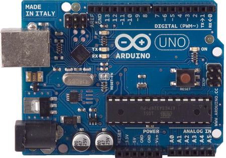
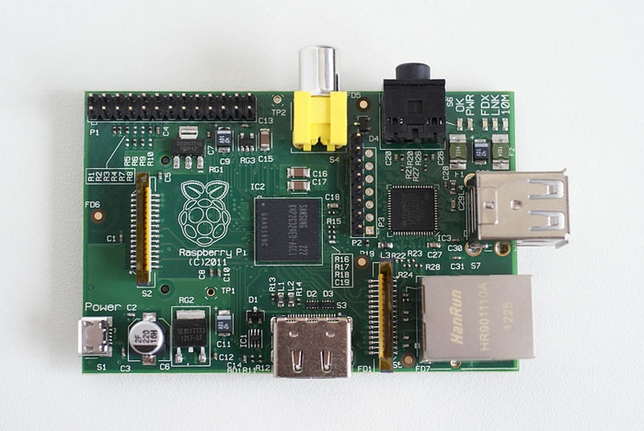

#物联网相关开源硬件

##Arduino

语言: Processing

> Arduino 是一款便捷灵活、方便上手的开源电子原型平台，包含硬件（各种型号的 arduino板）和软件（arduino IDE)。她适用于艺术家、设计师、爱好者和对于“互动”有兴趣的朋友们。 

> Arduino，是一个基于开放原始码的软硬体平台，构建于开放原始码simple I/O介面版，并且具有使用类似Java，C语言的Processing/Wiring开发环境。 

> Arduino能通过各种各样的传感器来感知环境，通过控制灯光、马达和其他的装置来反馈、影响环境。板子上的微控制器可以通过Arduino的编程语言来编写程序，编译成二进制文件，烧录进微控制器。对Arduino的编程是利用 Arduino编程语言 (基于Wiring)和 Arduino开发环境(based on Processing来实现的。基于Arduino的项目，可以只包含Arduino，也可以包含Arduino和其他一些在PC上运行的软件，他们之间进行通信 (比如 Flash, Processing, MaxMSP)来实现。

##Raspberry Pi 

语言: Any
主要有:``Python``,``C#``,``Ruby``

> 树莓派(raspberry pi)，是一款基于linux系统的、只有一张信用卡大小的卡片式计算机。研发树莓派的最初目的是通过低价硬件及自由软件来推动在学校的基础的计算机学科教育，但很快树莓派就得到计算机和硬件爱好者青睐；他们用它学习编程，并创造出各种各样新奇的、风靡一时的软硬件应用。

> 在接口方面，Raspberry Pi提供了可供键鼠使用的USB接口，此外还有快速以太网接口、SD卡扩展接口以及1个HDMI高清视频输出接口，可与显示器或者TV相连。

#物联网相关闭源硬件

